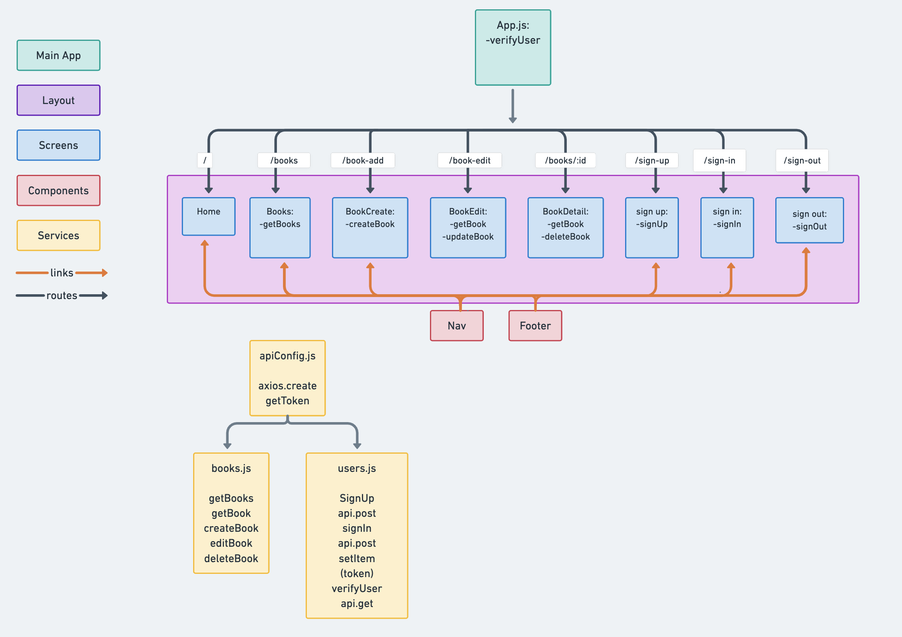

# JASZ-Library

## Overview
The JASZ Library is an interactive collection of books that allows anyone to browse the collection. A user can also sign up for an account and log in to add, edit, or delete a book in the collection.


## Whimsical Flowchart

### Pages


### Component Hierarchy



## Schema

### Book Schema:

```javascript
const Book = new Schema(
  {
    title: { type: String, required: true },
    author: { type: String, required: true },
    genre: { type: String, required: true },
    imgURL: { type: String, required: true },
    description: { type: String, required: true }
  },
  { timestamps: true }
)
```

### User Schema:

```javascript
const User = new Schema(
  {
    username: {
      type: String,
      required: true,
    },
    email: { type: String, required: true },
    password_digest: { type: String, required: true, select: false },
  },
  { timestamps: true }
)
```

## Team Expectations

Link to [Team Expectations Document](https://docs.google.com/document/d/1WMG7CX3tmeAdju4malt2lE7Vz8K2oUcaGM85A9WGWhY/edit)

## MVP

- Home page displaying some of the books in the library
- Browse page getting and showing all books in the library
- Book detail page showing the title, author, genre, cover, and description of the book
- Sign up page to create an account
- Sign in page to sign into your account
- Add a book page to add a book to the library
- Edit a book  page to update info for a book in the library
- Delete a book button to delete a book from the library
- Sort books by alphabetically by title, author (pst-MVP)
- Carousel of favorite books of class (post-MVP)
- Personalized book list per user (post-MVP)
- Recommended other books based on genre (post-MVP)
